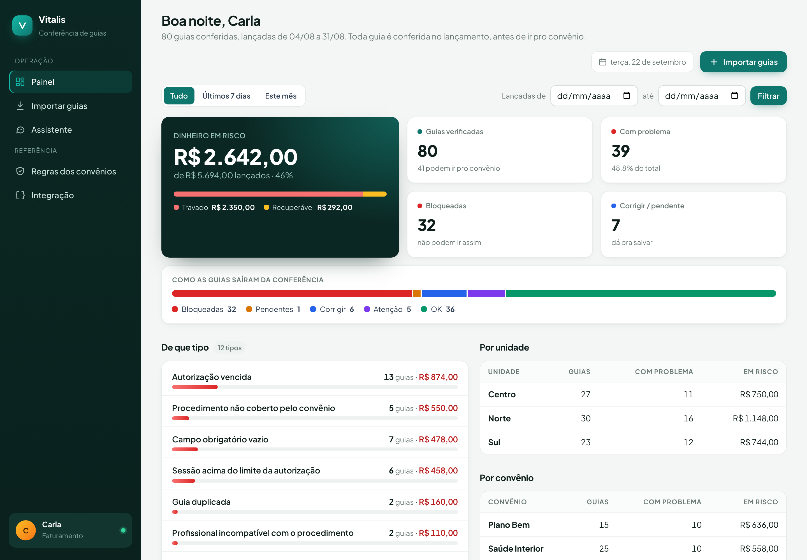

# Vitalis · conferência de guias antes do envio

Conferência automática das guias de convênio da Clínica Vitalis, feita **no lançamento, antes de a guia ir pro convênio**, sem depender de alguém lembrar. Toda terça o Dr. Renato vê quantas guias foram verificadas, quantas têm problema, de que tipo e quanto dinheiro está em risco.

Construído pra etapa técnica do processo seletivo da Expert Integrado. Nasceu pra esta prova.

## Em uma frase

A guia entra (API, CSV ou n8n) → formato normalizado → observação da recepção lida (IA, com fallback) → uma regra de cada vez → grava status, achados, ação e R$ em risco → dashboard, relatório de terça e alerta pra recepção.



## O que achei nas 80 guias de agosto

Conferência simulada no dia do lançamento de cada guia (a guia acabou de ser lançada e ainda não foi enviada):

| | Guias | R$ |
|---|---|---|
| Verificadas | 80 | 5.694,00 lançados |
| OK | 36 | |
| **Bloqueadas** (vão glosar do jeito que estão) | 32 | 2.350,00 |
| **Pendente** (autorização verbal aguardando número) | 1 | 62,00 |
| **Corrigir** (erro simples, conserta e envia) | 6 | 230,00 |
| Atenção (podem ir, alguém deveria olhar) | 5 | |
| **Em risco** | 39 | **2.642,00 (46% do lançado)** |

Por tipo: autorização vencida 13, campo obrigatório vazio 7 (3 sem número de autorização, 2 sem CID, 2 sem registro do profissional), sessão acima do limite 6, procedimento não coberto 5, profissional incompatível com o procedimento 2, guia duplicada 2, formato de data ou valor 3, e 4 que só a observação revela.

**Guia a guia, com o motivo de cada uma: [`docs/agosto_guia_a_guia.md`](docs/agosto_guia_a_guia.md).**

Quatro guias só se entendem lendo o que a recepção escreveu. É aí que a IA entra:

- **G-2608-0030**: autorização vencida, mas "paciente trouxe autorização nova, número ainda não lançado". Não é perda, é **corrigir**.
- **G-2608-0041**: sem número de autorização, mas "autorizado por telefone, protocolo 771203". Saúde Interior aceita verbal por 5 dias úteis (até 27/08). Conferida no lançamento (21/08), fica **pendente** com prazo, não bloqueada.
- **G-2608-0039**: passa em todas as regras, mas "paciente pediu para faturar como particular". **Bloqueada**: não pode ir pro convênio.
- **G-2608-0069**: consulta ortopédica lançada, mas "procedimento realizado foi drenagem linfática". **Bloqueada**: código errado, e drenagem nem existe na tabela dos convênios.

Extrapolando pras 900 guias/mês, seriam uns R$ 30 mil/mês em risco, o dobro da estimativa da Carla (40% dos 8% de glosa, uns R$ 14,5 mil). A amostra pode não ser representativa, mas é o primeiro número que o Dr. Renato vai querer discutir na terça.

## Esclarecimentos da Expert e como o código segue cada um

| Esclarecimento | Como está no código |
|---|---|
| **1.** O CSV só tem a data final da autorização; não existe data de concessão. A verificação possível é validade contra data do atendimento. | `regra_autorizacao` compara só validade x atendimento, com o último dia valendo. Não existe regra comparando a validade com o máximo de dias do convênio: seria inventar a data de concessão. |
| **2.** Pro lote de agosto, simular a conferência na data de lançamento: a guia acabou de ser lançada e ainda não foi enviada. O prazo de envio conta da data do atendimento. | A data de referência padrão é a `data_lancamento` da guia, **em todas as entradas** (lote, CSV e `POST /guias` de uma guia só). Prazo de envio = atendimento + prazo do convênio, comparado com o lançamento. O dashboard mostra "enviar até DD/MM" e quantos dias sobravam no lançamento. `?data_referencia=hoje` força hoje, se alguém quiser reconferir guia antiga ainda não enviada. |
| **3.** As 80 guias são um recorte, não o histórico das autorizações. Confere o que a guia declara. | O status de cada guia depende só do que ela declara + regras do convênio. Nada de somar sessões por autorização entre guias. Outras guias entram em dois lugares, nenhum que invente histórico: (a) **duplicata**, a mesma guia lançada duas vezes (mesma carteirinha, data, procedimento, autorização e sessão); (b) **dica** do registro do profissional na ação de correção. O resultado não muda com a ordem das guias nem com reenvio (tem teste pra isso). |

## Como funciona

```
                 ┌─ POST /guias          JSON, uma guia ou várias (é o que o n8n / sistema chama)
  guia entra ──┼─ POST /guias/lote     CSV exportado do sistema (o que a Carla tem hoje)
                 └─ n8n: webhook "guia lançada" → POST /guias → alerta Telegram da unidade
                       │
                       ▼
             validador/normalizador.py   03/08/2026 → 2026-08-03, "62,00" → 62.0, anota o que converteu
                       │
                       ▼
             validador/observacao.py     texto livre da recepção → intenção (IA → fallback, com cache)
                       │
                       ▼
             validador/regras.py         uma função por regra, cada uma devolve achados
                       │
                       ▼
             validador/motor.py          junta, decide status, calcula R$ em risco
                       │
                       ▼
             Postgres (Supabase) ──► GET /  dashboard  ·  GET /relatorio  JSON + mensagens prontas
                                     GET /guias/{id}  como a regra leu cada campo
                                     GET /convenios  regras em tela  ·  GET /integracao  endpoints e mensagens
```

### As regras

| Regra | O que olha | Resultado |
|---|---|---|
| Convênio conhecido | nome bate com `regras_convenio.json` | bloqueia |
| Campos obrigatórios | os campos que cada convênio exige | sem autorização ou CID: bloqueia · sem registro do profissional: corrigir · autorização verbal com protocolo: pendente até N dias úteis, depois bloqueia |
| Procedimento | código existe e o convênio cobre | bloqueia (no Plano Bem, a ação é "faturar como particular", como o convênio manda) |
| Autorização | validade x data do atendimento | bloqueia · vira corrigir se a recepção anotou autorização nova |
| Sessões | número da sessão x limite do convênio | bloqueia |
| Profissional | CREFITO pra fisioterapia, CRM pra consulta e infiltração | bloqueia se incompatível |
| Valor | valor x referência do procedimento | corrigir |
| Prazo de envio | atendimento + prazo do convênio x dia da conferência | vencido: bloqueia · até 7 dias: atenção |
| Duplicata | mesma guia lançada duas vezes | bloqueia a lançada por último |
| Observação | o que a recepção escreveu | particular ou código errado: bloqueia · remarcação ou reembolso: atenção |
| Formato | data com barra, valor com vírgula | corrigir (sem risco: o conteúdo está certo) |

### Severidades

| Status | Significa | Conta como risco? |
|---|---|---|
| `bloqueada` | Não pode ir pro convênio assim. Precisa de documento novo ou decisão. | sim |
| `pendente` | Esperando algo com prazo (número da autorização verbal). | sim, até resolver |
| `corrigir` | A informação existe, só não foi lançada certo: registro do profissional, autorização nova já em mãos, formato. | sim se tiver achado que glosa |
| `atencao` | Pode ir. Alguém deveria olhar. | não |
| `ok` | Pode enviar. | não |

`valor_em_risco` = valor da guia quando algum achado tem `glosa_provavel = true`.

### Onde entra IA (e onde não entra)

Só num lugar: ler `observacao_recepcao`, que é texto livre, e transformar em uma intenção (`nova_autorizacao`, `protocolo_verbal`, `faturar_particular`, `codigo_errado`, `remarcacao`, `reembolso`, `sem_acao`) mais detalhes (número do protocolo, validade escrita, procedimento realizado).

A decisão é sempre da regra. Cada guia bloqueada tem um motivo que dá pra explicar linha a linha, sem "o modelo achou". Se a IA errar a leitura, o erro fica num lugar só e aparece na página da guia ("lida como protocolo_verbal").

Ordem: cache no banco (o mesmo texto não vai pra IA duas vezes) → OpenAI (`gpt-4o-mini`, temperatura 0, resposta em JSON) → palavra-chave. Sem chave, com a API fora ou com resposta quebrada, o fallback assume e nada quebra. Os testes rodam sem IA e cobrem os três caminhos (IA ok, IA com lixo, IA fora do ar).

## Como uma guia nova entra

```bash
curl -X POST https://SEU-DOMINIO/guias \
  -H "X-API-Key: $API_KEY" -H "Content-Type: application/json" \
  -d @dados/exemplo_guia_nova.json
```

(`dados/exemplo_guia_nova.json` é uma guia inventada com quatro problemas: data com barra, valor com vírgula, sem registro do profissional e sessão 11 numa autorização de 10.)

Resposta na hora (resumida):

```json
{"id_guia": "G-2609-0001", "status": "bloqueada", "valor_em_risco": 62.0, "data_referencia": "2026-09-19",
 "mensagem": "*NÃO ENVIAR: G-2609-0001*\nSul · Vitalcard · paciente P-2001 · R$ 62,00\n- Formato de data ou valor: ...",
 "achados": [
   {"codigo": "FORMATO", "severidade": "corrigir", "campo": "data_atendimento", "acao": "Corrigir a data do atendimento no sistema para 2026-09-18."},
   {"codigo": "FORMATO", "severidade": "corrigir", "campo": "valor", "acao": "Corrigir o valor no sistema para 62.00."},
   {"codigo": "CAMPO_OBRIGATORIO_AUSENTE", "severidade": "corrigir", "campo": "profissional_registro",
    "acao": "Preencher com o registro de Felipe Andrade. Nas outras guias ele aparece como CREFITO-3 198302-F."},
   {"codigo": "SESSAO_EXCEDE_LIMITE", "severidade": "bloqueia", "mensagem": "Sessão nº 11 numa autorização que cobre 10.", "acao": "Precisa de nova autorização..."}
 ]}
```

- Campos a mais não atrapalham. Data com barra, valor com vírgula e espaço sobrando são tratados.
- Convênio desconhecido e valor ilegível viram achado, não erro. Corpo que não é JSON, guia sem `id_guia` e `data_referencia` inválida voltam 422 com mensagem clara.
- No lote, uma linha ruim entra na lista `erros` e as outras seguem.
- Mandar a mesma `id_guia` de novo atualiza a conferência, não duplica.
- `mensagem` já vem pronta pro WhatsApp/Telegram da recepção.

## n8n (pasta "Clínica Vitalis")

Três workflows em [`integracao/n8n/`](integracao/n8n), prontos pra importar. Todos têm um nó **Config** (único lugar pra mexer: domínio do app e chats do Telegram) e um post-it explicando o fluxo.

| Workflow | Quando | O que faz |
|---|---|---|
| **1. Conferir guia no lançamento** | webhook `POST /webhook/vitalis/guia` | Recebe a guia do sistema, chama `POST /guias`, devolve o resultado pra quem chamou e, se a guia não pode ir (bloqueada, pendente, corrigir), avisa o Telegram da unidade com a ação. Se o app cair, devolve 502 e avisa a Carla: nenhuma guia passa sem conferência sem alguém saber. |
| **2. Relatório de terça (Dr. Renato)** | terça 7h | `GET /relatorio` dos últimos 7 dias e manda o resumo antes da reunião das 7h30. |
| **3. Pendências do dia (Carla e recepção)** | seg a sex 8h | Lista o que resolver antes do envio, por unidade, com a ação de cada guia. Sem pendência, não manda nada. |

As mensagens vêm prontas do app (`mensagem`, `mensagem_whatsapp`, `mensagem_pendencias`). O n8n só agenda e entrega, e trocar Telegram por WhatsApp é trocar o último nó.

Credenciais a criar no n8n: **Vitalis API (X-API-Key)** (tipo Header Auth, nome `X-API-Key`, valor = `API_KEY` do app) e **Telegram** (bot).

**Importar (uns 2 minutos):**

1. No n8n, em Overview → Workflows, crie a pasta **Clínica Vitalis**.
2. Dentro dela: Create workflow → menu `...` → Import from File → escolha `1_conferir_guia_no_lancamento.json`. Salve. Repita com o 2 e o 3.
3. Em cada workflow, abra o nó **Config** e troque `app_url` pelo domínio do app. Preencha os chats do Telegram (id do grupo ou pessoa).
4. Nos nós HTTP e Telegram, selecione as duas credenciais no dropdown.
5. Teste: no 2 e no 3, clique em "Testar agora". No 1, mande a guia de exemplo pro webhook de teste: `curl -X POST https://SEU-N8N/webhook-test/vitalis/guia -H "Content-Type: application/json" -d @dados/exemplo_guia_nova.json`.
6. Ative os três.

## MCP e Skill

### MCP `vitalis-guias` ([`mcp_vitalis/server.py`](mcp_vitalis/server.py))

Um servidor MCP em cima dos dados da prova. Lê `dados/regras_convenio.json` e `dados/guias_agosto.csv` direto do repositório e carrega as 80 guias num SQLite em memória, sem banco externo e sem segredo. Usa **o mesmo motor de regras do app**: a decisão que sai no MCP é a mesma do painel (tem teste pra isso).

| Ferramenta | O que faz |
|---|---|
| `consultar_regra(convenio, procedimento)` | O que um convênio exige pra um procedimento: se cobre, valor de referência, registro exigido (CREFITO/CRM), campos obrigatórios, validade da autorização, limite de sessões, prazo de envio, autorização verbal e a observação do convênio. Aceita código ou nome ("infiltração") e convênio sem acento. |
| `verificar_guia(guia, data_referencia?)` | Confere uma guia e devolve **decisão (OK ou PENDENTE)**, status detalhado, **motivos** (problema, campo, motivo, o que corrigir), se vai glosar, R$ em risco e a mensagem pronta pra recepção. Não grava nada. |
| `buscar_guia(id_guia)` | Uma guia de agosto pelo id, com os dados como foram lançados e a conferência. |
| `listar_convenios()` | Convênios e procedimentos, pra traduzir o que a recepção escreveu. |
| `relatorio_da_semana(desde?, ate?)` | Os números do Dr. Renato num período, com a mensagem de terça pronta. |

**Instalar** (Python 3.10+):

```bash
git clone https://github.com/arkyniatech/vitalis-guias && cd vitalis-guias
python3 -m venv .venv && .venv/bin/pip install -r requirements.txt
```

- **Claude Code**: abrindo a pasta do repositório, o `.mcp.json` já registra o servidor (aprove quando pedir). Fora dela:
  `claude mcp add vitalis-guias -- /CAMINHO/vitalis-guias/.venv/bin/python /CAMINHO/vitalis-guias/mcp_vitalis/server.py`
- **Claude Desktop** (ou outro cliente MCP por stdio), no `claude_desktop_config.json`:

```json
{
  "mcpServers": {
    "vitalis-guias": {
      "command": "/CAMINHO/vitalis-guias/.venv/bin/python",
      "args": ["/CAMINHO/vitalis-guias/mcp_vitalis/server.py"]
    }
  }
}
```

Por padrão a observação da recepção é lida por palavra-chave (determinístico, bate com o gabarito). `VITALIS_MCP_IA=1` com `OPENAI_API_KEY` liga a IA. `VITALIS_GUIAS_CSV=/outro/arquivo.csv` troca a base de guias.

### Skill `conferir-guia` ([`skills/conferir-guia/SKILL.md`](skills/conferir-guia/SKILL.md))

Pra quem opera a clínica: a pessoa cola a guia do jeito que a recepção escreveu ("fisio muscular, aut AUT999001, sessão 11 de 10, Felipe sem registro, 62,00...") e recebe **OK ou PENDENTE**, o motivo e o que corrigir, em português simples. A Skill só traduz o texto em campos e explica o resultado. Quem decide é o `verificar_guia` do MCP: ela não inventa campo que não veio e não dá veredito sem o MCP.

- **Claude Code**: já vem em `.claude/skills/conferir-guia` (link pra `skills/conferir-guia`). Pra usar em qualquer projeto, copie a pasta pra `~/.claude/skills/`.
- **Claude Desktop / claude.ai**: compacte a pasta `skills/conferir-guia` em .zip e envie na área de Skills das configurações. Precisa do MCP acima conectado.

## Os números da terça

`GET /` mostra: verificadas, com problema, dinheiro em risco (travado nas bloqueadas x recuperável em corrigir e pendente), por tipo, por unidade, por convênio, e a lista do que fazer na ordem (bloqueadas primeiro, maior valor primeiro), com a ação de cada uma e até quando enviar. Filtro por data de lançamento.

`GET /relatorio?desde=AAAA-MM-DD` devolve o mesmo em JSON, mais `mensagem_whatsapp` (resumo de terça) e `mensagem_pendencias` (lista de trabalho).

## Rodar local

```bash
cp .env.example .env          # pode deixar DATABASE_URL vazio: usa SQLite em dados/vitalis.db
pip install -r requirements.txt
uvicorn app.main:app --reload
python scripts/carregar_lote.py dados/guias_agosto.csv http://localhost:8000 SUA_API_KEY
# abre http://localhost:8000/
```

Ou `docker compose up --build`.

Testes: `python -m pytest`. São 46, entre eles:

- o gabarito das 80 guias (`tests/gabarito_agosto.json`): se alguém mexer numa regra e uma guia mudar de lugar, o teste diz qual;
- as 80 guias entrando uma por uma pelo `POST /guias`, sem parâmetro nenhum, batendo com o lote;
- lote reenviado, invertido e embaralhado dando o mesmo resultado;
- um teste pra cada esclarecimento da Expert;
- o MCP devolvendo a mesma decisão e os mesmos números do app.

`python scripts/explicar_agosto.py` regenera o `docs/agosto_guia_a_guia.md`.

## Deploy (EasyPanel + Supabase)

1. **Supabase**: crie um projeto, copie a connection string (Settings → Database → URI, pooler em modo Session) e troque o prefixo pra `postgresql+psycopg://`. As tabelas são criadas na primeira subida.
2. **EasyPanel**: App → Source: GitHub (este repositório) → Build: Dockerfile → porta 8000 → domínio.
3. **Environment**: `DATABASE_URL`, `API_KEY`, `DASH_USER`, `DASH_PASS`, `OPENAI_API_KEY` (opcional). Nunca no repositório. Se o banco for dividido com outros sistemas, `DB_SCHEMA=vitalis` põe as tabelas num schema só delas.
4. Deploy. `GET /saude` responde `{"app":"ok","banco":"ok","ia":"openai"}`.
5. Carregue agosto: `python scripts/carregar_lote.py dados/guias_agosto.csv https://SEU-DOMINIO SUA_API_KEY`.
6. **n8n**: na pasta "Clínica Vitalis", preencha o nó Config de cada workflow e ligue as duas credenciais.

## Segurança e cuidado básico

- Segredos só em variável de ambiente. `.env` está no `.gitignore`; `.env.example` tem só placeholders.
- `POST /guias`, `/guias/lote` e `DELETE /guias/{id}` exigem `X-API-Key`. Dashboard e `/relatorio` exigem login (HTTP Basic) ou a mesma chave (pro n8n). Sem essas variáveis o app avisa no log que está aberto.
- Erro tratado em cada camada: JSON inválido → 422; guia sem id → 422; convênio desconhecido → achado, não exceção; uma regra que quebrar vira achado `ERRO_INTERNO_REGRA` e as outras seguem; linha ruim no lote não derruba o lote; IA fora do ar cai no fallback; app fora do ar → n8n devolve 502 e avisa a Carla.
- Sem dado clínico além do CID, que o convênio exige. Paciente é código anônimo.

## Decisões que eu defenderia na entrevista

- **Python + FastAPI pra regra, n8n pra orquestrar.** Regra em Code node de n8n é difícil de testar e de explicar. Aqui cada regra é uma função com nome e 46 testes rodam em 3 segundos. O n8n fica onde ele é bom: receber a guia, agendar e entregar a mensagem.
- **Regras no JSON, não no código.** `regras_convenio.json` é o que a Carla mandou. Mudou o limite do Plano Bem, troca o arquivo. O que é regra da clínica e não do convênio (CREFITO pra fisio, CRM pra médico) está num dicionário só, com comentário dizendo isso.
- **IA num lugar só, com fallback.** Ver acima.
- **Conferência no lançamento, sempre.** A mesma guia dá o mesmo resultado entrando por lote, CSV ou API. É o que o esclarecimento 2 pede e o que faz sentido na operação: a guia é conferida quando nasce.
- **Duplicata é a lançada por último.** A original segue; a cópia é bloqueada. Se chegarem fora de ordem, a conferência se corrige sozinha.
- **Registro do profissional vazio é "corrigir", CID vazio é "bloqueia".** O registro é cadastro: a recepção sabe quem atendeu. O CID precisa vir do pedido médico ou do profissional.
- **"Pediu recibo pra reembolso" é atenção, não erro.** Aparece em 8 guias. Sugere particular, mas não afirma. Bloquear seria inventar problema.
- **Consulta no Plano Bem não é erro de digitação, é regra do convênio.** A ação diz "faturar como particular", que é o que o JSON manda.
- **Mesmo código de paciente com carteirinha diferente não é duplicata** (G-2608-0017 e 0060). Duplicata compara o que o convênio confere: carteirinha e autorização.

## O que faltou (teto de 6 horas)

- Integração real com a API do sistema de gestão (não tenho acesso). O `POST /guias` e o webhook do n8n são o contrato; falta o gatilho do lado do sistema.
- Botão "resolvido" no dashboard pra recepção marcar o que corrigiu. Hoje a guia sai da lista quando é reenviada corrigida, o que é o fluxo certo com a integração.
- Feriados no cálculo de dias úteis da autorização verbal.
- Histórico de glosa real pra calibrar o `glosa_provavel` (hoje é regra, não estatística).

## Estrutura

```
app/
  main.py                 rotas, autenticação, tratamento de erro
  config.py               variáveis de ambiente
  db.py                   tabelas guias, achados, observacoes_classificadas (Postgres ou SQLite)
  relatorio.py            agregações do dashboard e mensagens prontas
  validador/
    normalizador.py       tipos e formatos
    regras_convenio.py    carrega o JSON dos convênios
    observacao.py         IA + fallback + cache
    regras.py             uma função por regra
    motor.py              orquestra, decide status, reconfere duplicata fora de ordem
  templates/              dashboard.html, guia.html, regras.html, integracao.html
mcp_vitalis/server.py     MCP: consultar_regra, verificar_guia, buscar_guia, listar_convenios, relatorio_da_semana
skills/conferir-guia/     Skill pra recepção e faturamento (usa o MCP)
dados/                    regras_convenio.json, guias_agosto.csv
docs/                     agosto_guia_a_guia.md
tests/                    gabarito das 80 guias, regras, esclarecimentos, observação, API
integracao/n8n/           os 3 workflows da pasta "Clínica Vitalis"
scripts/                  carregar_lote.py, explicar_agosto.py
```
